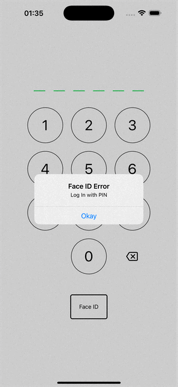
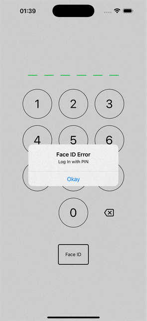

## Follow these steps

Application Setup (DO THIS FIRST)

- Clone the repository via `git clone`.
- The project is developed using `node` version **18.0.0** and `npm`/`package-lock.json`.
- Run `npm install`, then run `npm start`.
- Select `i` to run in iOS Simulator or `a` in Android emulator.

---

### Assumption about the app

1. Most data in redux are mostly predefined, meaning they are in the initialState. However, some data such as **user's balance amount**, **account type** and **account number** are fetched via simple API simulation.
2. Features that are prioritized during development are the **four required features**.
3. **FaceID** and **Fingerprint** are not able to be tested in Expo Go. To test them, you will need to create an `eas build` for both Platforms.
4. If you can't test biometrics, you should still be able to use the fallback component **(PinPadScreen)**.
5. To create bank transfer, select **New Transfer"** button in the Home page.
6. The minimum balance in your bank account must be **RM 20.00**. If you try to create a bank transfer and your resulting balance will lead to less than RM 20.00, you will be redirected to an error page.
7. When creating bank transfer, the forms will be populated with the data except for the **amount**. You will need to fill in the amount field yourself.

### Decision and Challenges

1. This app uses Expo, Redux, LocalAuthentication, VectorIcon, React Navigation and NetInfo for dependencies.
2. The flow of the app is **PinPadScreen** for authentication to the **MainStackNavigator**.
3. After authenticated, in HomeScreen, create payment by clicking **New Transfer** button to go to **CreatePaymentScreen**.
4. From there, **CreatePaymentScreen** => **PaymentCheckScreen** => **PinPadScreen** => **SuccessPaymentScreen** for successful bank transfer.
5. **CreatePaymentScreen** => **PaymentCheckScreen** => **SuccessPaymentScreen** for unsuccessful bank transfer.
6. In **ProfileScreen**, I only inserted **Log Out** button as the only feature in the ProfileScreen. This is to get log out and log in features.
7. Challenges are for me to create the wireframe of the app within a short period of time. To mitigate this, I referred to existing Bank apps to observe payment flow.
8. Another challenge is minimal time spent to properly integrate performance optimization code (eg. memoization such as useCallback, useMemo, memo., Strategically implement componentWillUnmount to unsubscribe or reset redux data, add lazy loading for some expensive components using React lazy and Suspense)

---

### Demo in GIF

#### Demo for Success

---

#### Demo for Error

